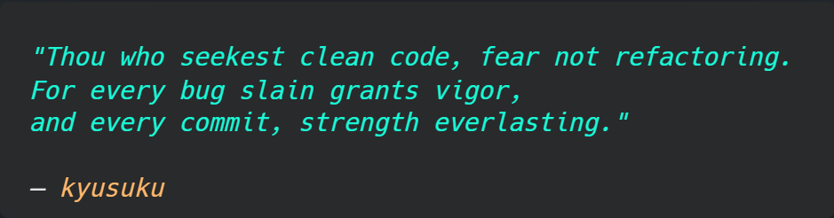

# Hi 👋, I'm Tampraphon Lorattanasane!  

  

## 🌍 About Me  

- 📍 **Location:** Bangkok, Thailand  
- 🎓 **Education:** University of Michigan - Shanghai Jiao Tong University Joint Institute  
- 🚀 **Currently Working On:** The Odin Project  

  

---

## 🔧 Technologies & Tools  

  

---

## 📌 Featured Projects  

### 🌟 The Odin Project

| Project                      | Description                                                                                           | Repository                                             | Live Preview                                                      | Responsive Design |
| ---------------------------- | ----------------------------------------------------------------------------------------------------- |:------------------------------------------------------:|:-----------------------------------------------------------------:|:-----------------:|
| **Recipes**                  | A simple HTML-based collection of recipes, marking the start of my journey                            | [Code](https://github.com/kyusuku/odin-recipes)        | [Demo](https://kyusuku.github.io/odin-recipes/)                   | ❌
| **Landing Page**             | A simple HTML & CSS landing page built with CSS Flexbox layout structure                              | [Code](https://github.com/kyusuku/landing-page)        | [Demo](https://kyusuku.github.io/landing-page/)                   | ❌
| **Rock Paper Scissors**      | A JavaScript implementation of the classic game                                                       | [Code](https://github.com/kyusuku/rock-paper-scissors) | [Demo](https://kyusuku.github.io/rock-paper-scissors/)            | ❌
| **Etch-a-Sketch**            | A JavaScript-based Etch A Sketch simulation, showcasing DOM manipulation skills                       | [Code](https://github.com/kyusuku/etch-a-sketch)       | [Demo](https://kyusuku.github.io/etch-a-sketch/)                  | ❌
| **Calculator**               | A JavaScript-powered calculator that supports basic operations and offers an interactive design       | [Code](https://github.com/kyusuku/calculator)          | [Demo](https://kyusuku.github.io/calculator/)                     | ❌      
| **Sign-up Form**             | A user registration form built with HTML and CSS, focusing on form structure and styling              | [Code](https://github.com/kyusuku/sign-up-form)        | [Demo](https://kyusuku.github.io/sign-up-form/)                   | ❌               
| **Admin Dashboard**          | A dashboard layout created with HTML and CSS, utilizing CSS Grid for layout structure                 | [Code](https://github.com/kyusuku/admin-dashboard)     | [Demo](https://kyusuku.github.io/admin-dashboard/)                | ❌
| **Library**                  | A JavaScript-powered book management app with add, remove, and update features using a dialog box     | [Code](https://github.com/kyusuku/library)             | [Demo](https://kyusuku.github.io/library/)                        | ❌
| **Tic Tac Toe**              | A JavaScript-powered Tic Tac Toe game with player turns and win detection                             | [Code](https://github.com/kyusuku/tic-tac-toe)         | [Demo](https://kyusuku.github.io/tic-tac-toe/)                    | ❌
| **Restaurant Page**          | A dynamic restaurant website built with HTML, CSS, and JavaScript, focusing on Webpack integration    | [Code](https://github.com/kyusuku/restaurant-page)     | [Demo](https://kyusuku.github.io/restaurant-page/)                | ❌
| **Todo List**                | A task management app with dynamic content updates and persistent storage using Web Storage API       | [Code](https://github.com/kyusuku/to-do-list)          | [Demo](https://kyusuku.github.io/to-do-list/)                     | ❌
| **Weather App**              | A weather app that fetches real-time data, supports unit toggling, and displays dynamic weather icons | [Code](https://github.com/kyusuku/weather-app)         | [Demo](https://kyusuku.github.io/weather-app/)                    | ❌
| **Homepage**                 | A professional-looking personal homepage built with responsive design principles                      | [Code](https://github.com/kyusuku/homepage)            | [Demo](https://kyusuku.github.io/homepage/)                       | ✅
| **CV Application**           | A responsive and downloadable CV builder built with React, TypeScript, Tailwind CSS, and Vite         | [Code](https://github.com/kyusuku/cv-application)      | [Demo](https://kyusuku-cv-maker.vercel.app/)                      | ✅
| **Memory Card**              | A dynamic memory game built with React, TypeScript, Tailwind CSS, Vite, and PokéAPI                   | [Code](https://github.com/kyusuku/memory-card)         | [Demo](https://kyusuku-memory-card.vercel.app/)                   | ✅
| **Shopping Cart**            | An e-commerce mock store built with React, TypeScript, Tailwind CSS, Vite, and FakeStoreAPI           | [Code](https://github.com/kyusuku/shopping-cart)       | [Demo](https://threadware.vercel.app/)                            | ✅
| **Basic Informational Site** | A simple Node.js site serving static HTML pages with basic routing, also featuring an Express version | [Code](https://github.com/kyusuku/basic-info-site)     | -                                                                 | ❌
| **Mini Message Board**       | A simple Node.js, Express, and PostgreSQL app that displays and allows adding messages dynamically    | [Code](https://github.com/kyusuku/mini-message-board)  | [Demo](https://mini-message-board-production-9bb5.up.railway.app) | ❌ 

---

## 📈 GitHub Stats  

  
    
  
    
  
    
  

---

### 📫 Let's Connect!  

  
  

