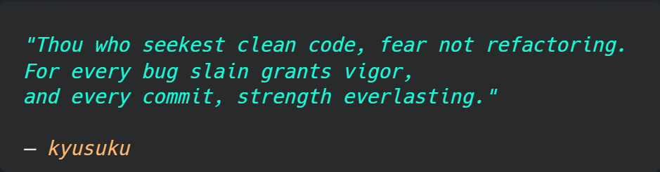

# Hi 👋, I'm Tampraphon Lorattanasane!  

  

## 🌍 About Me  

- 📍 **Location:** Bangkok, Thailand  
- 🎓 **Education:** Shanghai Jiao Tong University

  

---

## 🔧 Technologies & Tools  

  

---

## 📈 GitHub Stats  

  
    
  
    
  
    
  

---

### 📫 Let's Connect!  

  
  

